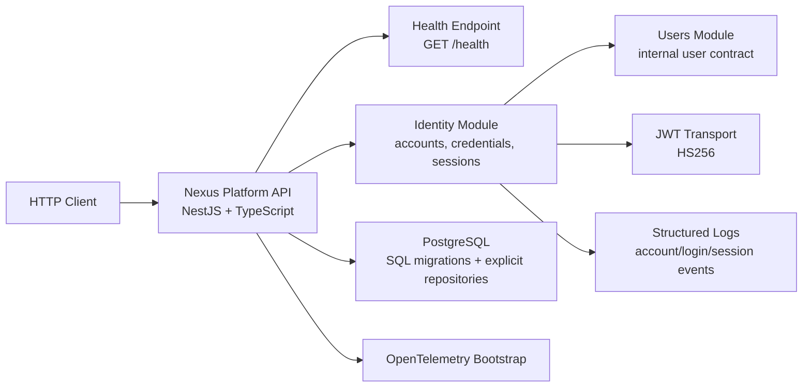

# Architecture

## Overview

Phase 1 turns the foundation into a first functional slice of the platform. The repository remains a modular monolith, but now `users` and `identity` contain real domain/application/infrastructure code and a working authentication flow.

## C4-lite Diagram

## Module Boundaries

- `src/bootstrap`: startup, validation pipe, global error mapping, config, logging, migrations and database lifecycle.
- `src/modules/users`: owns the minimal internal user record consumed by `identity`.
- `src/modules/identity`: owns account creation, password hashing, login, session persistence, token issue and logout.
- `src/modules/organizations`, `src/modules/access-control`, `src/modules/audit-logs`: still placeholders for later phases.
- `src/shared`: shared technical/domain primitives that do not collapse module boundaries.

## Active Decisions in Phase 1

- PostgreSQL still uses `pg` directly with explicit repository implementations.
- SQL migrations are versioned in `migrations/` and applied automatically during bootstrap.
- Passwords are hashed with Argon2id and never persisted in clear text.
- JWT is only a transport token; revocation authority remains the persisted `sessions` table.
- Authentication errors stay generic at the HTTP boundary to avoid leaking account existence or status.

## Phase 1 Constraints Preserved

- No tenant resolution yet in the authentication flow.
- No RBAC enforcement yet.
- No full audit log append-only module yet.
- No external message bus or SSO/OIDC integration yet.
