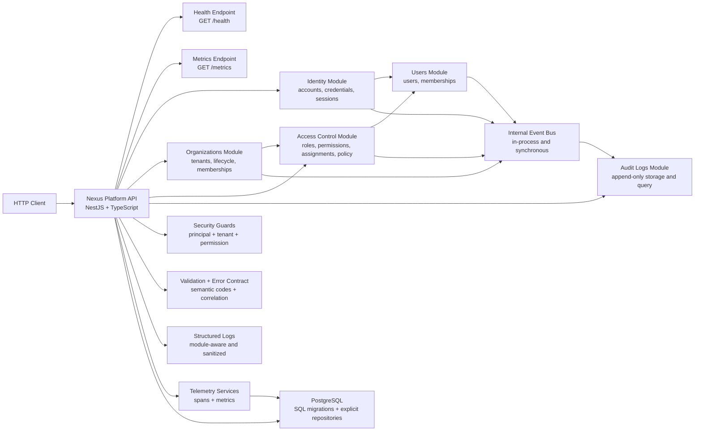

# Architecture

## Overview

Phase 5 hardens the tenant-scoped RBAC platform with consistent validation, standardized HTTP errors, broader test coverage and operational observability. The repository remains a modular monolith where `identity`, `organizations`, `users`, `access-control` and `audit-logs` collaborate through explicit contracts, shared guards and a synchronous internal event bus.

## C4-lite Diagram



## Module Boundaries

- `src/bootstrap`: startup, validation pipe, global error mapping, config, logging, metrics, telemetry, migrations and database lifecycle.
- `src/modules/identity`: owns account creation, password hashing, login, session persistence, token issue and logout.
- `src/modules/organizations`: owns tenant lifecycle and organization-scoped membership flows.
- `src/modules/users`: owns the global user record plus `memberships`.
- `src/modules/access-control`: owns `roles`, `permissions`, `role_permissions`, `user_role_assignments` and the authorization decision.
- `src/modules/audit-logs`: owns append-only `audit_logs`, audit query use cases and internal event subscribers.
- `src/shared`: security, tenancy, request correlation and internal event primitives reused without collapsing module boundaries.

## Active Decisions in Phase 5

- PostgreSQL still uses `pg` directly with explicit repository implementations.
- SQL migrations remain versioned in `migrations/` and are applied automatically during bootstrap.
- Authorization stays explicit and deny-by-default for all protected routes.
- Audit rows remain append-only and correlated to the originating request when available.
- Validation is centralized at the HTTP boundary with DTOs plus a custom exception factory.
- The public error payload is standardized as `{ error, message, correlation_id }`.
- `GET /metrics` is exposed by the application and expected to be protected operationally at the infrastructure edge.
- HTTP, authorization and audit queries are instrumented through manual OpenTelemetry spans and in-memory Prometheus-style counters/histograms.
- Audit and membership list endpoints use explicit pagination and tenant-aware SQL plus composite indexes.

## Security Flow

```text
Authenticated request
  -> resolve or generate correlation id
  -> resolve authenticated principal from session/token
  -> resolve active tenant from session or route
  -> validate active organization
  -> validate active membership
  -> resolve required permission metadata
  -> authorize allow / deny
  -> execute use case
  -> publish internal audit event when applicable
```

### Guard composition

- Session-scoped RBAC endpoints use `AuthenticatedRequestGuard -> ActiveTenantGuard -> AuthorizationGuard`.
- Path-scoped organization endpoints use `AuthenticatedRequestGuard -> TenantContextGuard -> AuthorizationGuard`.
- Audit log queries use `AuthenticatedRequestGuard -> ActiveTenantGuard -> AuthorizationGuard` plus `audit:view`.
- `POST /organizations` stays outside RBAC because the tenant and default role do not exist yet.

## Multi-Tenancy Rules Applied

- All RBAC tables carry `organization_id`.
- Cross-tenant links are blocked with composite foreign keys on `(organization_id, id)` pairs.
- Authorization decisions always use the active organization from the request context.
- Tenant mismatch between route or query and the session tenant is denied before application code runs.
- Reads and writes remain tenant-aware, including audit query and membership listing.

## Observability Surface

### Logs

- `pino` emits structured logs with `module`, `correlation_id`, `tenant_id` and `user_id`.
- `Authorization`, cookies and stack traces are sanitized before emission.
- module failures are logged with semantic error codes and exported as metrics.

### Tracing

- the HTTP entrypoint starts and finishes a request span for every request
- `DatabaseExecutor` emits `database.query` and `database.transaction` spans
- `InternalEventBus` emits `internal_event.publish` and `internal_event.handle` spans
- critical use cases emit spans for login, account creation, organization creation, membership assignment, RBAC mutation, authorization and audit operations

### Metrics

- `nexus_http_requests_total`
- `nexus_http_request_duration_ms`
- `nexus_module_failures_total`
- `nexus_identity_logins_total`
- `nexus_authorization_decisions_total`
- `nexus_audit_operations_total`
- `nexus_audit_operation_duration_ms`

## Constraints Preserved

- no external message bus or distributed workflow engine
- membership remains the prerequisite for tenant login
- no new business modules were introduced in Phase 5
- controllers remain thin and business rules stay inside application/domain layers
- observability was expanded without breaking the modular monolith boundaries
