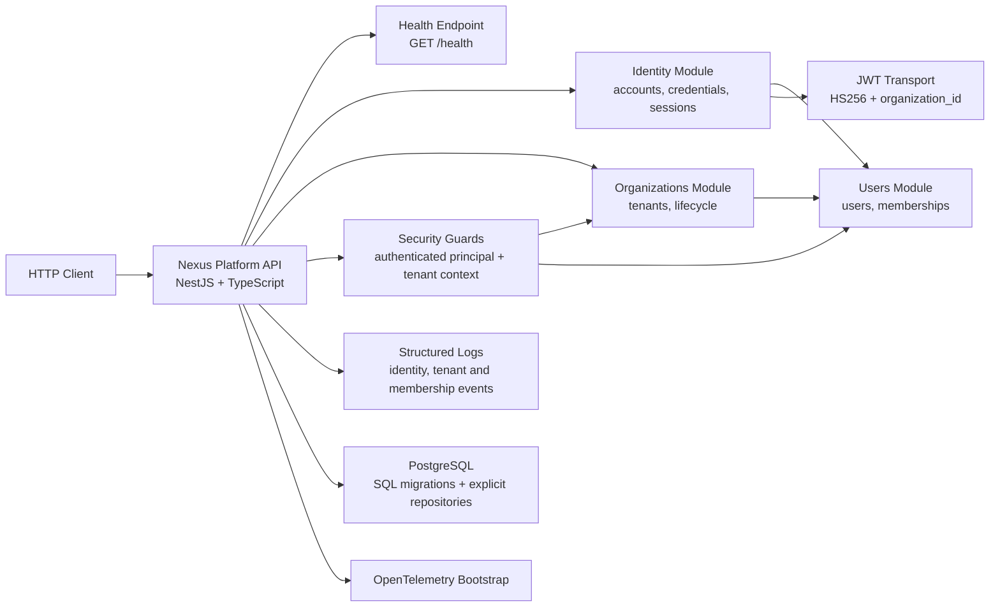

# Architecture

## Overview

Phase 2 turns the initial identity slice into a real multi-tenant foundation. The repository remains a modular monolith, but `organizations`, `users` and `identity` now collaborate through explicit contracts to enforce tenant isolation at the request boundary and in persistence.

## C4-lite Diagram

## Module Boundaries

- `src/bootstrap`: startup, validation pipe, global error mapping, config, logging, migrations and database lifecycle.
- `src/modules/users`: owns the global user record plus `memberships`.
- `src/modules/organizations`: owns `organizations` and coordinates organization-scoped membership flows.
- `src/modules/identity`: owns account creation, password hashing, login, session persistence, token issue and logout.
- `src/modules/access-control`, `src/modules/audit-logs`: still placeholders for later phases.
- `src/shared`: shared security/tenancy primitives that do not collapse module boundaries.

## Active Decisions in Phase 2

- PostgreSQL still uses `pg` directly with explicit repository implementations.
- SQL migrations are versioned in `migrations/` and applied automatically during bootstrap.
- Passwords are hashed with Argon2id and never persisted in clear text.
- JWT is still only a transport token; revocation and tenant authority remain the persisted `sessions` table.
- Sessions can be bootstrap (`organization_id = null`) or tenant-bound (`organization_id != null`).
- Tenant-scoped routes require both authenticated principal resolution and tenant context resolution.
- Authentication errors stay generic for invalid credentials, while tenant failures are explicit after successful authentication.

## Multi-Tenancy Rules Applied

- `organizations` represent logical tenants and can be `active` or `inactive`.
- `memberships` represent the `user ↔ organization` relationship and gate access.
- Requests without valid tenant context are denied on protected organization routes.
- Tenant-aware data access is filtered by `organization_id`.
- Tenant mismatch between route and session is denied before application code runs.

## Constraints Preserved

- No RBAC enforcement yet; active membership is the temporary access rule.
- No full audit log append-only module yet.
- No external message bus or SSO/OIDC integration yet.
