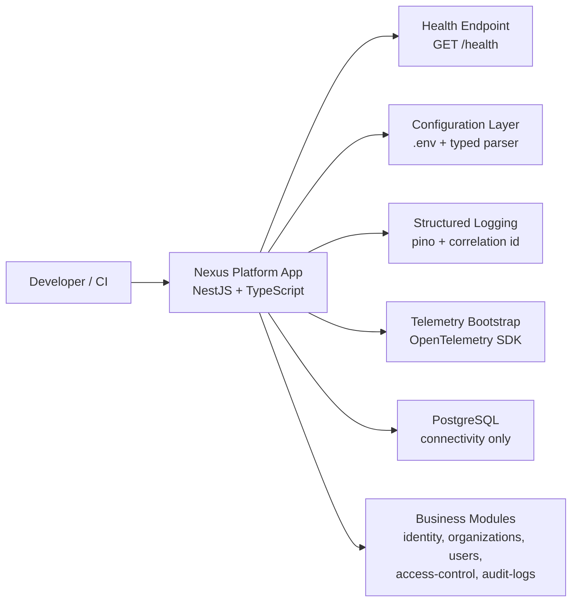

# Architecture

## Overview

Phase 0 establishes the operational shell of the Nexus Platform without introducing business logic. The repository is organized as a modular monolith with explicit domain boundaries and a clean split between bootstrap/infrastructure concerns and future domain/application code.

## C4-lite Diagram

## Module Boundaries

- `src/bootstrap`: app startup, HTTP entrypoints, config, logging, persistence and telemetry.
- `src/modules`: business modules reserved for domain/application/infrastructure growth without cross-module shortcuts.
- `src/shared`: shared technical and tactical building blocks that must not become a domain dumping ground.
- `src/jobs`: scheduled/background workloads reserved for future phases.

## Architectural Decisions Active in Phase 0

- Modular Monolith as the initial deployment model.
- PostgreSQL connectivity is established with `pg` directly, without ORM or schema ownership yet.
- No domain rules, authentication, authorization or tenant logic are implemented in the foundation.
- Multi-tenancy, deny-by-default authorization and immutable audit logs remain mandatory future constraints and must shape any new module contracts.
