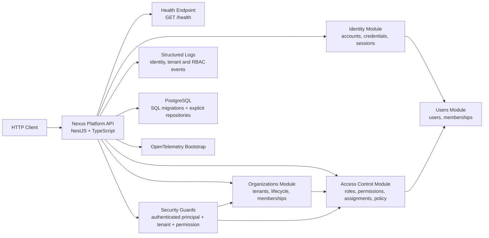

# Architecture

## Overview

Phase 3 turns the multi-tenant foundation into a tenant-scoped RBAC platform. The repository remains a modular monolith, but `identity`, `organizations`, `users` and `access-control` now collaborate through explicit contracts and shared guards to enforce both tenant isolation and authorization at the request boundary.

## C4-lite Diagram



## Module Boundaries

- `src/bootstrap`: startup, validation pipe, global error mapping, config, logging, migrations and database lifecycle.
- `src/modules/identity`: owns account creation, password hashing, login, session persistence, token issue and logout.
- `src/modules/organizations`: owns tenant lifecycle and organization-scoped membership flows.
- `src/modules/users`: owns the global user record plus `memberships`.
- `src/modules/access-control`: owns `roles`, `permissions`, `role_permissions`, `user_role_assignments` and the authorization decision.
- `src/modules/audit-logs`: still placeholder for the next phase.
- `src/shared`: security and tenancy primitives that are reused without collapsing module boundaries.

## Active Decisions in Phase 3

- PostgreSQL still uses `pg` directly with explicit repository implementations.
- SQL migrations remain versioned in `migrations/` and are applied automatically during bootstrap.
- Permissions are tenant-local, even when codes repeat across tenants.
- Existing active memberships were backfilled with `organization_admin` to preserve the current access baseline during the RBAC rollout.
- New organizations bootstrap the default permission catalog, `organization_admin` role and creator assignment inside the same transaction flow as tenant creation.
- Authorization is explicit and deny-by-default for all protected routes.

## Security Flow

```text
Authenticated request
  -> resolve authenticated principal from session/token
  -> resolve active tenant from session or route
  -> validate active organization
  -> validate active membership
  -> resolve required permission metadata
  -> authorize allow / deny
  -> execute use case
```

### Guard composition

- Session-scoped RBAC endpoints use `AuthenticatedRequestGuard -> ActiveTenantGuard -> AuthorizationGuard`.
- Path-scoped organization endpoints use `AuthenticatedRequestGuard -> TenantContextGuard -> AuthorizationGuard`.
- `POST /organizations` stays outside RBAC because the tenant and default role do not exist yet.

## Multi-Tenancy Rules Applied

- All RBAC tables carry `organization_id`.
- Cross-tenant links are blocked with composite foreign keys on `(organization_id, id)` pairs.
- Authorization decisions always use the active organization from the request context.
- Tenant mismatch between route and session is denied before application code runs.
- Cross-tenant access remains denied even if the actor has valid roles in another tenant.

## Constraints Preserved

- No append-only audit log module yet; only structured logs were added in this phase.
- No external message bus or ACL/ABAC model.
- Membership remains the prerequisite for login into a tenant; RBAC only governs what the authenticated member can do after login.
